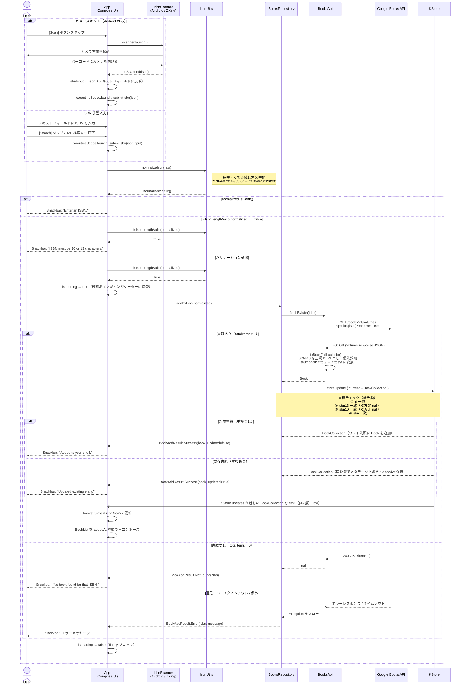

# Recobook 基本設計書

**バージョン**: 1.0.0  
**最終更新**: 2026-03-31  
**対象プロジェクト**: [Recobook](./README.MD)

---

## 目次

1. [アプリ概要](#1-アプリ概要)
2. [前提条件・制約](#2-前提条件制約)
3. [画面一覧](#3-画面一覧)
4. [機能一覧](#4-機能一覧)
5. [アーキテクチャ](#5-アーキテクチャ)
6. [データ設計](#6-データ設計)
7. [セキュリティ設計](#7-セキュリティ設計)
8. [Google Play ストアポリシー上の注意点](#8-google-play-ストアポリシー上の注意点)

---

## 1. アプリ概要

### 1.1 アプリ名

**Recobook** — *Your shelf, cataloged.*

### 1.2 目的

ISBN（書籍識別番号）を入力またはバーコードスキャンで書籍を検索し、個人の本棚を管理するアプリ。書籍情報は Google Books API から自動取得し、端末内にローカル保存する。

### 1.3 対応プラットフォーム

| プラットフォーム | 備考 |
|---|---|
| Android | Min SDK 23（Android 6.0）以上 / バーコードスキャン対応 |
| iOS | iOS 16.2 以上 |
| Desktop | macOS / Windows / Linux（JVM） |
| Web | Kotlin/JS・Kotlin/Wasm（ブラウザ） |

### 1.4 技術スタック

| 技術 | バージョン | 用途 |
|---|---|---|
| Kotlin | 2.3.0 | メイン言語 |
| Compose Multiplatform | 1.10.0 | 共通 UI フレームワーク |
| Material Design 3 | 1.10.0-alpha05 | UI コンポーネント |
| Ktor | 3.3.3 | HTTP クライアント |
| KStore | 1.0.0 | ローカルデータ永続化 |
| Coil | 3.3.0 | 書影の非同期ロード |
| kotlinx.serialization | 1.9.0 | JSON シリアライズ |
| kotlinx.coroutines | 1.10.2 | 非同期処理 |
| ZXing Android Embedded | 4.3.0 | バーコードスキャン（Android のみ） |
| Metro | 0.9.4 | 依存性注入 |

---

## 2. 前提条件・制約

### 2.1 前提条件

| 項目 | 内容 |
|---|---|
| ネットワーク | 書籍検索はインターネット接続が必要（ローカル登録済みデータの閲覧・削除はオフライン可） |
| Google Books API | 認証不要の公開 API を使用。1 日あたりの無料クォータは 1,000 リクエスト（2026 年 3 月時点） |
| カメラ | バーコードスキャンは Android のみ対応。カメラなし端末でも他機能は利用可 |
| ストレージ | 書籍データは各端末のローカルストレージに保存。クラウド同期なし |

### 2.2 制約・非機能要件

| 項目 | 制約 |
|---|---|
| ユーザー認証 | 実装なし。ユーザーアカウント不要 |
| データ同期 | 端末間同期なし。ローカル保存のみ |
| オフライン検索 | 不可（Google Books API への通信が必要） |
| ISBN 形式 | 10 桁または 13 桁のみ。ハイフン・スペースは正規化時に除去される |
| テーマ | ライト / ダーク を手動切替。システムテーマ連動は起動時のデフォルト値のみ |
| 多言語対応 | UI 文字列は英語のみ（strings.xml で管理、将来の多言語化は可能な構造） |
| データバックアップ | Android の自動バックアップ設定に依存（明示的なバックアップ機能なし） |

---

## 3. 画面一覧

本アプリは **単一画面（シングルスクリーン）** 構成である。ナビゲーションなし。

### 3.1 メイン画面（唯一の画面）

```
┌─────────────────────────────────────┐
│  Recobook                [Theme]    │  ← HeaderRow
│  Your shelf, cataloged.             │
├─────────────────────────────────────┤
│  ┌─────────────────────────────┐   │
│  │  ISBN (10 or 13)            │   │  ← IsbnInputCard
│  └─────────────────────────────┘   │
│  [ Search ]         [ Scan ]        │  ← Scan ボタンは Android のみ表示
├─────────────────────────────────────┤
│  ─────────────────────────────────  │  ← HorizontalDivider
│                                     │
│  ┌───┬────────────────────┬──────┐  │
│  │📖 │ タイトル           │Remove│  │  ← BookCard（登録あり時）
│  │   │ 著者               │      │  │
│  │   │ 出版社 • 出版日    │      │  │
│  │   │ ISBN XXXXXXXXXX    │      │  │
│  └───┴────────────────────┴──────┘  │
│  （以下 LazyColumn でスクロール）    │
│                                     │
│  No books yet. Add one by ISBN.     │  ← EmptyState（登録なし時）
└─────────────────────────────────────┘
```

#### 画面要素の詳細

| コンポーネント | 役割 | 表示条件 |
|---|---|---|
| `HeaderRow` | アプリ名・タグライン・テーマ切替ボタン | 常時表示 |
| `IsbnInputCard` | ISBN テキストフィールド・検索ボタン・スキャンボタン | 常時表示 |
| Scan ボタン | バーコードカメラ起動 | `IsbnScanner.isAvailable == true`（Android のみ） |
| 検索ボタン | ローディングインジケーター兼用 | 常時表示（検索中は `CircularProgressIndicator` に切替） |
| `EmptyState` | 未登録時のプレースホルダー | `books.isEmpty()` のとき |
| `BookList` | 登録書籍一覧（`addedAt` 降順） | `books.isNotEmpty()` のとき |
| `BookCard` | 書影・タイトル・著者・出版社・出版日・ISBN・削除ボタン | 各書籍エントリ |
| Snackbar | 操作結果メッセージ | 検索・追加・更新・エラー時 |

#### Snackbar メッセージ一覧

| タイミング | メッセージ |
|---|---|
| ISBN が空または空白のみ | `Enter an ISBN.` |
| ISBN の桁数が 10 でも 13 でもない | `ISBN must be 10 or 13 characters.` |
| 新規追加成功 | `Added to your shelf.` |
| 既存エントリ更新成功 | `Updated existing entry.` |
| 該当書籍なし | `No book found for that ISBN.` |
| 通信エラー等 | API エラーメッセージをそのまま表示 |

---

## 4. 機能一覧

### 4.1 書籍登録

| # | 機能 | 説明 |
|---|---|---|
| F-01 | ISBN 手動入力 | テキストフィールドに ISBN-10 または ISBN-13 を入力 |
| F-02 | ISBN 正規化 | 入力値から数字と `X` 以外を除去し大文字化（ハイフン・スペース除去） |
| F-03 | ISBN 桁数バリデーション | 正規化後に 10 桁または 13 桁でない場合はエラー通知 |
| F-04 | バーコードスキャン | カメラで ISBN バーコードを読み取り自動入力（**Android のみ**） |
| F-05 | Google Books API 検索 | `https://www.googleapis.com/books/v1/volumes?q=isbn:{isbn}&maxResults=1` に GET リクエスト |
| F-06 | 書籍データ変換 | API レスポンスから `Book` モデルに変換。ISBN-13 を正規 ISBN として優先採用 |
| F-07 | サムネイル HTTPS 化 | `thumbnail` URL の `http://` を `https://` に強制変換 |
| F-08 | タイトルフォールバック | API レスポンスのタイトルが空の場合は ISBN を代替タイトルとして使用 |

### 4.2 重複検出・更新

| # | 機能 | 説明 |
|---|---|---|
| F-09 | 重複判定 | 以下のいずれかが一致する場合は既存エントリとみなす：①`id` 一致、② `isbn13` 一致（双方非 null）、③ `isbn10` 一致（双方非 null）、④ `isbn` 一致 |
| F-10 | メタデータ上書き更新 | 重複時は最新の API メタデータで上書き。ただし登録日時（`addedAt`）は保持 |

### 4.3 本棚管理

| # | 機能 | 説明 |
|---|---|---|
| F-11 | 書籍一覧表示 | 登録日時（`addedAt`）降順で表示 |
| F-12 | 書籍カード表示 | 書影・タイトル・著者・出版社・出版日・ISBN を表示。書影がない場合は「No Cover」プレースホルダーを表示 |
| F-13 | 書籍削除 | `id` を指定してコレクションから削除 |
| F-14 | 空状態表示 | 書籍未登録時にガイドメッセージを表示 |

### 4.4 表示・テーマ

| # | 機能 | 説明 |
|---|---|---|
| F-15 | ライト / ダークテーマ切替 | ヘッダーの「Theme」ボタンで切替。`LocalThemeIsDark` による状態管理 |
| F-16 | iOS ステータスバー連動 | iOS では `UIStatusBarStyleDarkContent` / `LightContent` をテーマに連動して更新 |
| F-17 | Safe Area 対応 | `WindowInsets.safeDrawing` でノッチ・ナビゲーションバーに対応 |

### 4.5 データ永続化

| # | 機能 | 説明 |
|---|---|---|
| F-18 | ローカル保存 | 書籍データを JSON 形式で端末内に保存（プラットフォームごとに保存先が異なる。後述） |
| F-19 | 起動時自動読み込み | アプリ起動時に既存データを自動復元 |
| F-20 | リアルタイム同期 | KStore の `Flow` により UI とストレージが常時同期 |

---

## 5. アーキテクチャ

### 5.1 レイヤー構成

```
┌──────────────────────────────────────────────────────────┐
│                  Presentation Layer                       │
│  App.kt（Compose UI）                                     │
│  ├── HeaderRow        テーマ切替                          │
│  ├── IsbnInputCard    ISBN 入力・スキャン起動              │
│  ├── BookList         書籍一覧（LazyColumn）              │
│  ├── BookCard         書籍カード 1 件                     │
│  └── EmptyState       未登録時プレースホルダー            │
└────────────────────────┬─────────────────────────────────┘
                         │ Flow / suspend fun
┌────────────────────────▼─────────────────────────────────┐
│                   Domain Layer                            │
│  BooksRepository                                          │
│  ├── books: Flow<List<Book>>    書籍一覧ストリーム        │
│  ├── addByIsbn(isbn)            検索・追加・更新          │
│  └── removeById(id)             削除                      │
└──────────────┬────────────────────────┬──────────────────┘
               │ suspend fun            │ KStore API
┌──────────────▼──────────┐  ┌─────────▼────────────────────┐
│   Data Layer             │  │   Storage Layer               │
│   BooksApi               │  │   KStore<BookCollection>      │
│   ・fetchByIsbn(isbn)    │  │   ├── Android  : filesDir/    │
│                          │  │   │              recobook_     │
│   Google Books API       │  │   │              books.json    │
│   (HTTPS / Ktor)         │  │   ├── iOS       : Documents/  │
│                          │  │   │              recobook/     │
└──────────────────────────┘  │   │              books.json    │
                               │   ├── Desktop  : ~/.recobook/ │
                               │   │              books.json    │
                               │   └── Web      : localStorage │
                               │              ["recobook_books"]│
                               └──────────────────────────────┘
```

### 5.2 モジュール構成

```
Recobook/
├── sharedUI/                        ← Kotlin Multiplatform ライブラリ
│   └── src/
│       ├── commonMain/              共通コード（UI・Repository・Api・Model）
│       ├── androidMain/             Android 固有（BookStoreProvider・IsbnScanner）
│       ├── iosMain/                 iOS 固有（BookStoreProvider・IsbnScanner・エントリポイント）
│       ├── jvmMain/                 Desktop 固有（BookStoreProvider・IsbnScanner）
│       ├── webMain/                 Web 固有（BookStoreProvider・IsbnScanner）
│       ├── commonTest/              共通テスト（IsbnUtils・BooksApi）
│       ├── jvmTest/                 JVM テスト（BooksRepository・BookStoreProvider）
│       └── iosTest/                 iOS テスト（BookStoreProvider）
├── androidApp/                      Android アプリエントリポイント
├── desktopApp/                      Desktop アプリエントリポイント
├── webApp/                          Web アプリエントリポイント（JS + WasmJS）
└── iosApp/                          iOS アプリエントリポイント（Xcode プロジェクト）
```

### 5.3 expect / actual 設計

プラットフォーム固有の処理は `expect / actual` で分離する。

| 関数 / クラス | commonMain（expect） | Android | iOS | Desktop | Web |
|---|---|---|---|---|---|
| `createBookStore()` | `expect fun` | `filesDir` を使用 | `NSDocumentDirectory` を使用 | `user.home` を使用 | `localStorage` を使用 |
| `rememberIsbnScanner()` | `@Composable expect fun` | ZXing でバーコードスキャン | スキャン不可（`isAvailable = false`） | スキャン不可 | スキャン不可 |

### 5.4 状態管理

UI 状態は Compose の `remember` / `mutableStateOf` で管理する。永続データは `KStore.updates` が返す `Flow<BookCollection?>` を `collectAsState` で購読し、自動的に UI へ反映される。

```
KStore.updates (Flow)
       │
       ▼ map { it?.items.orEmpty() }
BooksRepository.books (Flow<List<Book>>)
       │
       ▼ collectAsState(emptyList())
App composable の books 変数（State<List<Book>>）
       │
       ▼ 再コンポーズ
BookList / EmptyState
```

---

## 6. データ設計

### 6.1 ストレージ形式

リレーショナルデータベース（SQLite 等）は使用しない。書籍データは **単一 JSON ファイル**（または Web の場合は `localStorage` の単一エントリ）として保存される。

シリアライズには `kotlinx.serialization` を使用。読み込み時は `ignoreUnknownKeys = true` / `isLenient = true` で後方互換性を確保している。

### 6.2 データ構造

#### BookCollection（ルートオブジェクト）

書籍データ全体を包むコンテナ。JSON ファイル 1 つが 1 つの `BookCollection` に対応する。

| フィールド | 型 | 説明 |
|---|---|---|
| `items` | `List<Book>` | 登録書籍のリスト（順序は登録日時降順で UI 側がソート） |

#### Book（書籍エントリ）

| フィールド | 型 | 制約 | 説明 |
|---|---|---|---|
| `id` | `String` | NOT NULL | Google Books ボリューム ID（存在しない場合は正規 ISBN） |
| `isbn` | `String` | NOT NULL | 正規 ISBN（ISBN-13 優先、次いで ISBN-10、最終的に入力値） |
| `isbn10` | `String?` | NULL 許可 | ISBN-10 |
| `isbn13` | `String?` | NULL 許可 | ISBN-13 |
| `title` | `String` | NOT NULL | 書籍タイトル（空の場合は ISBN で代替） |
| `authors` | `List<String>` | デフォルト空リスト | 著者名リスト |
| `publisher` | `String?` | NULL 許可 | 出版社名 |
| `publishedDate` | `String?` | NULL 許可 | 出版日（API レスポンスに依存し `YYYY`・`YYYY-MM`・`YYYY-MM-DD` の複数形式が混在） |
| `description` | `String?` | NULL 許可 | 書籍説明 |
| `thumbnailUrl` | `String?` | NULL 許可 | 書影 URL（常に `https://` に変換済み） |
| `pageCount` | `Int?` | NULL 許可 | ページ数 |
| `categories` | `List<String>` | デフォルト空リスト | カテゴリ／ジャンルリスト |
| `addedAt` | `Long` | NOT NULL | 登録日時（エポックミリ秒）。更新時も保持される |

### 6.3 保存先パス

| プラットフォーム | パス |
|---|---|
| Android | `{Context.filesDir}/recobook_books.json` |
| iOS | `{NSDocumentDirectory}/recobook/books.json` |
| Desktop (JVM) | `{user.home}/.recobook/books.json` |
| Web (JS / WasmJS) | `localStorage["recobook_books"]` |

Android・iOS・Desktop のパスは、アプリ初回起動時にディレクトリが存在しない場合に自動作成される。

### 6.4 重複検出ロジック

追加時に既存コレクション内を走査し、以下の条件を **いずれか**が満たす場合を既存エントリと判定する（先着優先）。

```
既存エントリ.id      == 追加対象.id           （常に評価）
既存エントリ.isbn13  == 追加対象.isbn13        （双方非 null の場合のみ）
既存エントリ.isbn10  == 追加対象.isbn10        （双方非 null の場合のみ）
既存エントリ.isbn    == 追加対象.isbn          （常に評価）
```

重複と判定された場合：
- メタデータ（タイトル・著者等）は最新の API 取得値に上書き
- `addedAt`（登録日時）は**既存の値を保持**（リストの表示順が変わらないようにするため）
- リスト内の**位置は変化しない**（末尾への追加や先頭移動は行わない）

新規エントリの場合：
- リストの**先頭に追加**（降順ソートで最上部に表示するため）

---

## 7. セキュリティ設計

### 7.1 認証・認可

本アプリはユーザー認証機能を持たない。データは完全にローカル管理であり、アクセス制御は OS のアプリサンドボックスに依存する。

### 7.2 データ暗号化

| 対象 | 暗号化 | 理由 |
|---|---|---|
| ローカルストレージの書籍データ | **なし** | 書籍メタデータは公開情報であり、機密性は低い |
| API 通信 | **あり（HTTPS）** | Google Books API との通信は TLS で保護される |
| 書影 URL | **URL レベルで HTTPS 強制** | `http://` プレフィックスを `https://` に変換してから保存・表示 |

### 7.3 鍵管理

暗号化キーは存在しない。

Android リリースビルドの署名キーは環境変数経由で管理する（`build.gradle.kts` にハードコードしない）。

| 環境変数 | 内容 |
|---|---|
| `RECOBOOK_ANDROID_JKS_PATH` | キーストアファイルのパス |
| `RECOBOOK_ANDROID_JKS_PASSWORD` | キーストアのパスワード |
| `RECOBOOK_ANDROID_JKS_ALIAS` | キーエイリアス |
| `RECOBOOK_ANDROID_JKS_KEY_PASSWORD` | キーのパスワード |

### 7.4 ネットワーク通信

外部通信先は Google Books API のみ。

| エンドポイント | 用途 | 認証 |
|---|---|---|
| `https://www.googleapis.com/books/v1/volumes` | ISBN による書籍検索 | 不要（公開 API） |

その他の外部通信は存在しない。広告 SDK・アナリティクス SDK は一切組み込んでいない。

### 7.5 権限

#### Android

| 権限 | 用途 | 必須 |
|---|---|---|
| `android.permission.CAMERA` | ISBN バーコードスキャン（ZXing） | 任意（`required="false"`） |
| `android.permission.INTERNET` | Google Books API 通信 | 必須（Ktor の依存関係経由で自動付与） |

`CAMERA` はランタイムパーミッションであり、スキャン機能の起動時に OS が許可ダイアログを表示する。ユーザーが拒否した場合でも ISBN 手動入力で全機能を利用できる。

#### iOS

`NSCameraUsageDescription` キーの `Info.plist` への追加は必要なし（iOS 版にバーコードスキャン機能なし）。ネットワーク通信に関する `NSAppTransportSecurity` 制限も、HTTPS 通信のため不要。

### 7.6 個人情報・プライバシー

- ユーザーの個人情報は一切収集・送信しない
- 書籍データはデバイスローカルにのみ保存され、外部サーバーに送信されない
- Google Books API へのリクエストには ISBN のみが含まれ、ユーザー識別情報は含まれない
- アプリは広告 ID・デバイス ID・位置情報などのトラッキング情報を使用しない

---

## 8. Google Play ストアポリシー上の注意点

### 8.1 データセーフティ（Data Safety）セクション

Google Play Console のデータセーフティフォームでは以下のように申告する。

| 質問 | 回答 | 根拠 |
|---|---|---|
| ユーザーのデータを収集または共有するか | **いいえ** | 書籍データはローカルにのみ保存。外部送信なし |
| アプリがデータを収集するか（データセーフティフォーム上） | 該当なし | Google Books API への ISBN 送信はユーザー固有情報を含まないため、収集には該当しない |
| データは保護されているか | **はい（転送中の暗号化）** | API 通信は HTTPS |

### 8.2 CAMERA 権限に関する申告

`android.permission.CAMERA` を使用するため、以下の対応が必要。

- ストア掲載の**説明文**に「ISBN バーコードスキャン機能にカメラを使用する（オプション機能）」と明記する
- `<uses-feature android:name="android.hardware.camera" android:required="false" />` を AndroidManifest.xml に設定済み（対応済み）→ カメラを持たない端末もインストール可能

### 8.3 ターゲット API レベル

Google Play の要件として、新規アプリ・アップデートともに最新の Target SDK バージョンへの対応が求められる。現在 `targetSdk = 36` を指定しており、2026 年 3 月時点の要件を満たしている。

### 8.4 コンテンツレーティング

本アプリは書籍管理ツールであり、有害コンテンツを含まない。コンテンツレーティングアンケートは「ユーティリティ / 生産性」カテゴリを選択し、**全年齢対象（IARC 3+）** の評価が見込まれる。

### 8.5 Google Books API 利用規約

- Google Books API の利用規約（[Terms of Service](https://developers.google.com/books/terms)）を遵守すること
- 無料クォータ（1 日 1,000 リクエスト）内での利用に留めること。超過する規模のユーザーベースが想定される場合は課金設定または API キーの設定が必要
- API から取得した書籍データを再配布・商業利用する場合は別途 Google のポリシーを確認すること
- 本アプリは取得データを端末内にのみ保存しており、外部配信・再配布は行っていないため、個人利用の範囲では問題ない

### 8.6 In-App Purchases / サブスクリプション

本アプリは課金機能を持たない。Google Play Billing Library は組み込んでいないため、申告不要。

### 8.7 広告

本アプリは広告を表示しない。Google AdMob・その他広告 SDK は含まれていないため、広告に関するポリシー対応は不要。

---

## 9. シーケンス図

### 9.1 ISBN 入力 → 書籍取得 → 表示

カメラスキャン（Android のみ）と手動入力の 2 経路を起点に、バリデーション・API 呼び出し・ストア更新・UI 反映までの一連の流れを示す。



#### フロー補足

| ポイント | 説明 |
|---|---|
| **スキャン後の自動検索** | カメラスキャン成功時はテキストフィールドへの反映と同時に `submitIsbn` が自動呼び出される。手動入力と異なりボタン操作不要 |
| **`isLoading` の制御タイミング** | バリデーションエラーの場合は `isLoading = true` に**ならない**。検索ボタンは常に有効なまま |
| **`isLoading ← false` の保証** | `finally` ブロックで実行されるため、API 成功・404・例外のいずれの場合でも必ずリセットされる |
| **UI 反映の非同期性** | `store.update` 完了後、`KStore.updates` Flow の emit はストレージ書き込みが完了してから行われる。`-)` 矢印で非同期通知を表している |
| **重複時の位置保持** | 更新時はリスト内の**既存インデックスを維持**する。先頭への移動は行わないため、`addedAt` による表示順は変化しない |
